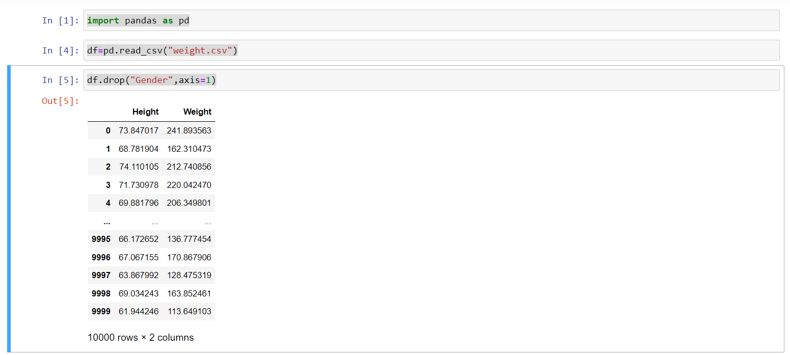
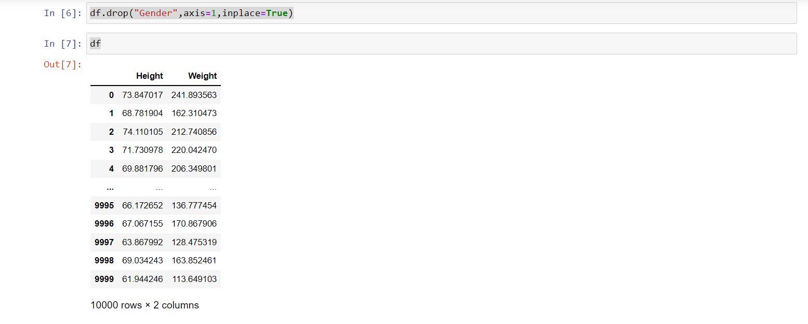
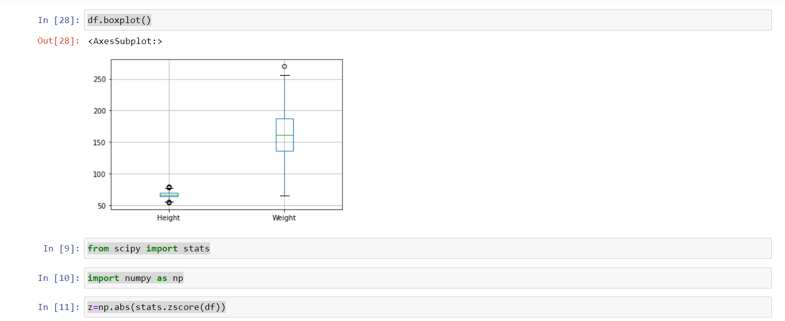
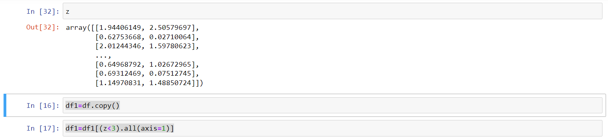
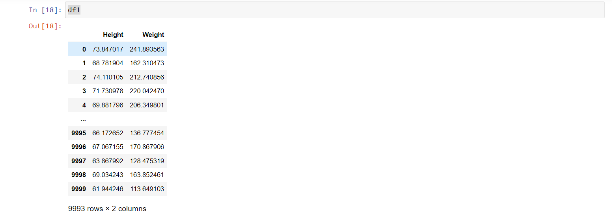
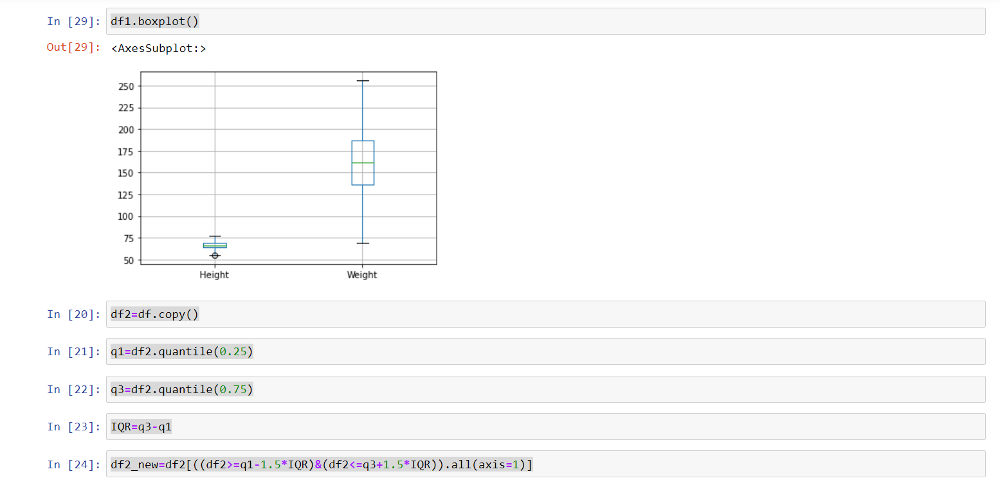
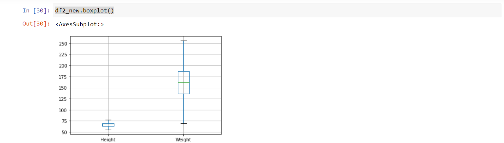
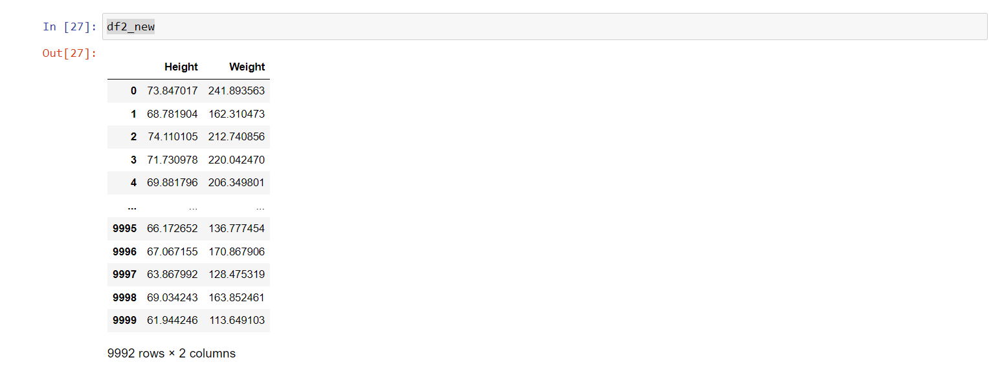

# Ex-02_DS_Outlier
# AIM
To Detect and Remove Outliers from the given Dataset.

# Explanation
 The analysis for outlier detection is referred to as outlier mining. There are many ways to detect the outliers, and the removal process is the data frame same as removing a data item from the panda’s data frame.

Here pandas data frame is used for a more realistic approach as in real-world project need to detect the outliers arouse during the data analysis step, the same approach can be used on lists and series-type objects.

# ALGORITHM
# STEP 1
 Importing Necessary Packages

# STEP 2
Read and Load the Dataset

# STEP 3
Plot the Distribution plots for the features

# STEP 4
Finding the IQR,upper,lower limit and Outliers

# STEP 5
 Form a Box-plot for the skewed feature

# CODE
```
import pandas as pd
df=pd.read_csv("weight.csv")
df.drop("Gender",axis=1)
df.drop("Gender",axis=1,inplace=True)
df
df.boxplot()

from scipy import stats
import numpy as np
z=np.abs(stats.zscore(df))
z

df1=df.copy()
df1=df1[(z<3).all(axis=1)]
df1
df1.boxplot()

df2=df.copy()
q1=df2.quantile(0.25)
q3=df2.quantile(0.75)
IQR=q3-q1
df2_new=df2[((df2>=q1-1.5*IQR)&(df2<=q3+1.5*IQR)).all(axis=1)]
df2_new.boxplot()
df2_new
```
# OUTPUT:









# RESULT:
The Outliers are detected and removed from the Dataset.